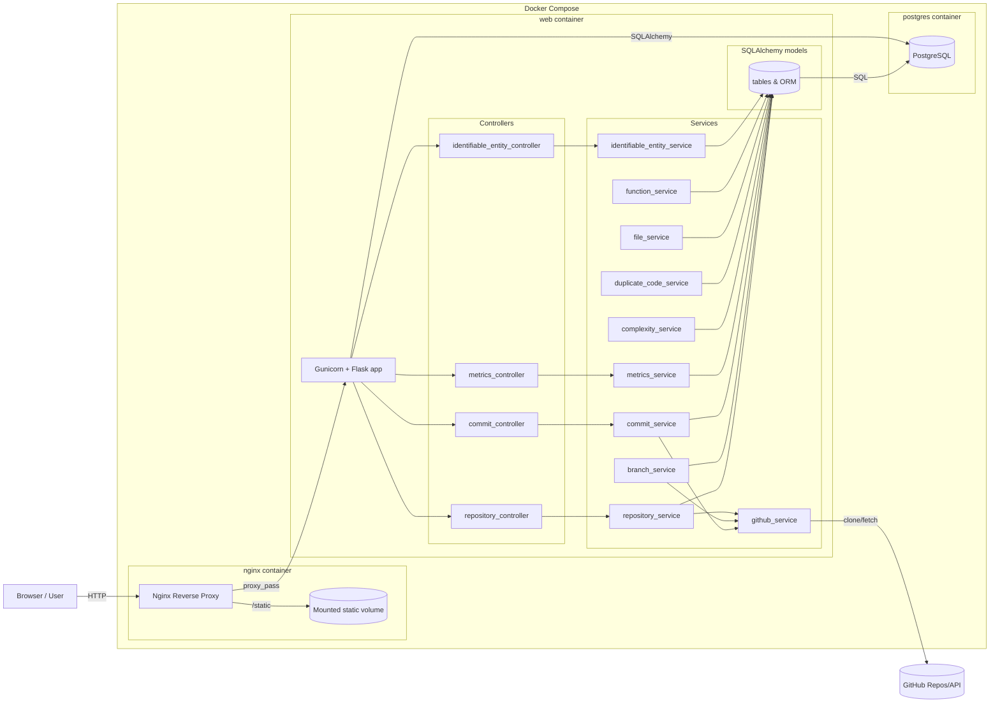
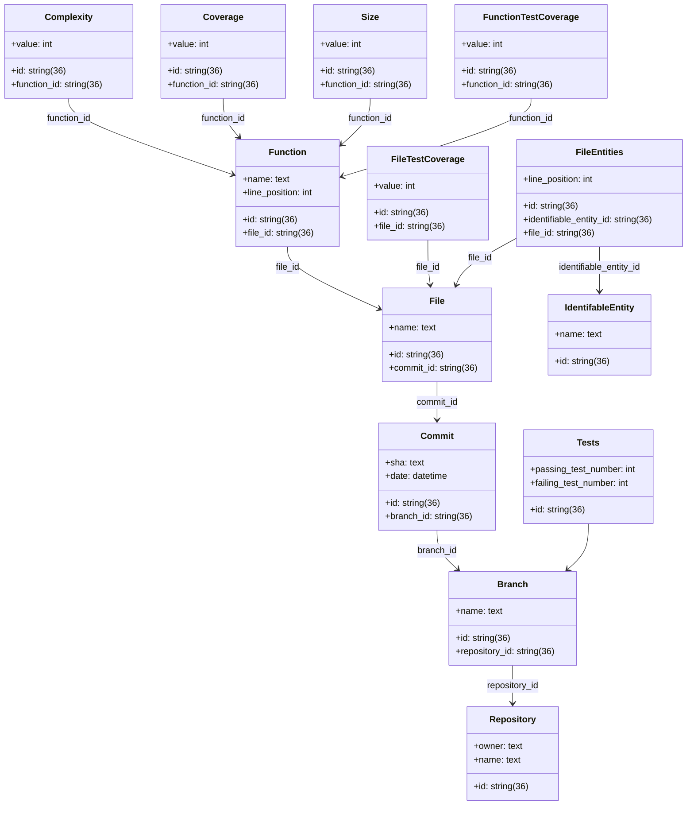

## Technical Debt Analyzer

### How to run the application:

1. Navigate to the ```web``` folder
2. Add a ```.env``` file with your Github token (Based on the .env.example)
3. Navigate to the root of the project
4. ```sudo docker compose build```
5. ```sudo docker compose up -d```
6. Go to localhost in your browser
7. To disable application type ```docker compose down```

### How to generate a Github token

1. Open the following url ```https://github.com/settings/tokens```
2. Generate a new token (classic)
3. Give full repo access to the token
4. Generate the token
5. Copy the token to the .env file

## Component Diagram



## Class Diagram


