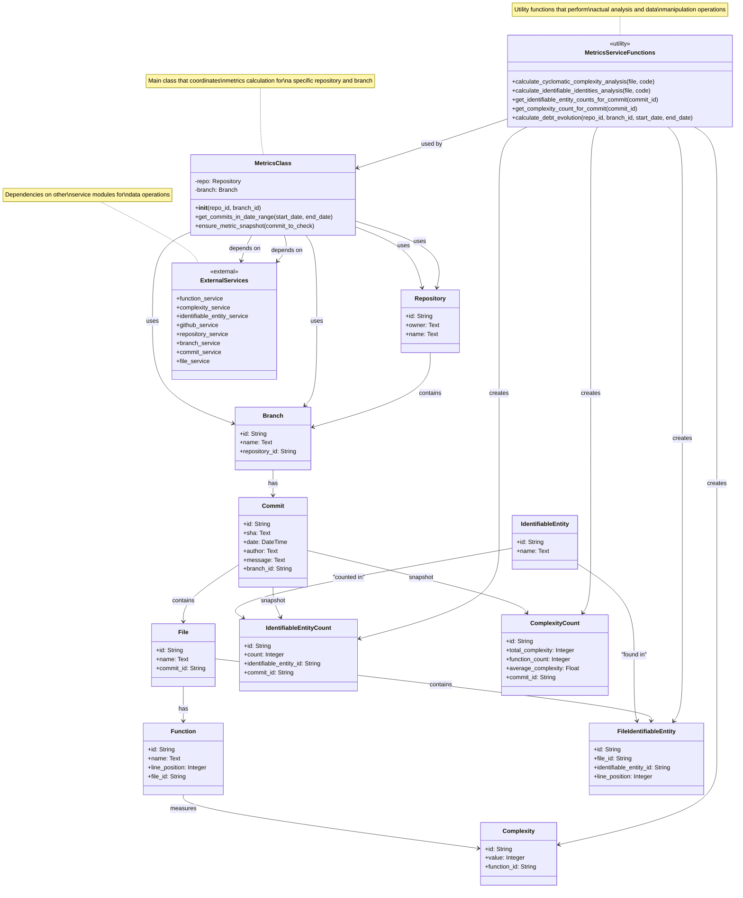

# Metrics Service Class Diagram

## Description

This class diagram shows the structure of the `metrics_service.py` module and its interactions with the data models. 

### Key Components:

1. **MetricsClass**: The main orchestrator class that handles metrics calculation for a specific repository and branch.

2. **Data Models**: Core entities representing the domain objects (Repository, Branch, Commit, File, Function, etc.)

3. **Metrics Models**: Specialized models for storing calculated metrics (IdentifiableEntityCount, ComplexityCount, Complexity)

4. **Service Functions**: Utility functions that perform specific analysis tasks like calculating complexity and finding identifiable entities.

5. **External Dependencies**: Other service modules that this service depends on for various operations.

### Main Workflow:
1. MetricsClass is initialized with repository and branch IDs
2. It can fetch commits in a date range
3. For each commit, it ensures metrics snapshots exist by:
   - Fetching file contents from GitHub
   - Analyzing files for complexity and identifiable entities
   - Storing results in the database
4. Various utility functions support querying and aggregating the stored metrics data