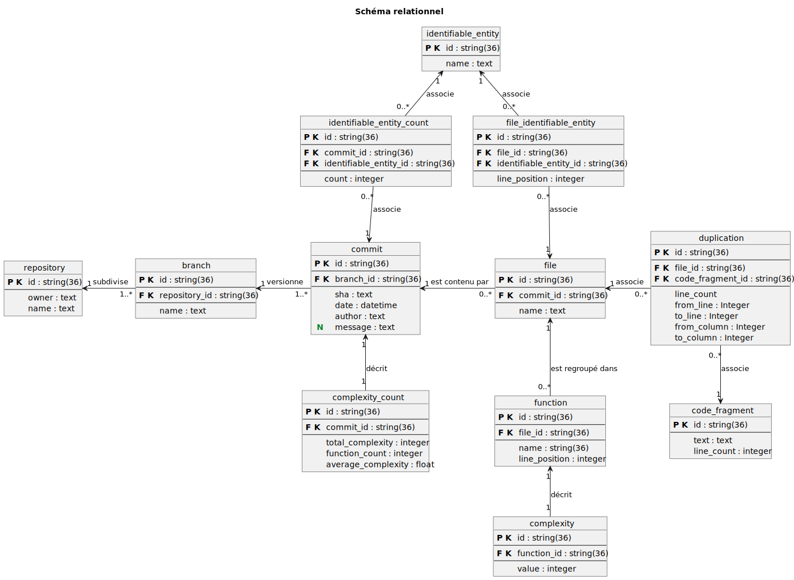

# Base de données

## Mise en contexte et Objectif

Dans le cadre du développement d'un outil pour analyser et suivre la dette technique, nous utilisions des outils et des librairies pour obtenir et analyser des projets versionnés sur Github. Pour éviter de devoir tout recalculer à chaque fois, nous avons fait l'usage d'une base de donnée pour persister ces informations. Dans ce projet, une base de donnée Postgres est utilisé pour réaliser la persistence des données. 

## Analyse

**Hiérarchie de versionnage**

Le système est intrinsèquement lié à la structure de versionnage git puisque cette technologie est utilisée pour cloner sur le serveur des projets. Ainsi, la conception de la base de donnée s'est inspirée de la hiérarchie du versionnage Git pour modéliser les entités principales du système. 

Nous avons identifiés les entités suivantes: 
- Repository
- Branch 
- Commit
- File

Pour la modélisation des métriques, il faut noter que les métriques sont obtenues par différents outils et que chaque métrique est calculée d'une certaine façon. Conséquemment, la modélisation des entités de métriques a été influencée par ces différences. 

**Duplications**

Pour la duplication de code, l'arrangement des données obtenues par l'outil PMD a été calqué pour la modélisation des entités. Les entités identifiées sont les suivantes: 
- Duplication
    - Association entre un fragment de code et un fichier
- CodeFragment
    - Bout de code détecté à plusieurs endroits

**Todo-fixme**

Bien qu'aucun outil est utilisé pour cette métrique, la modélisation est similaire à celle des duplications : 

- Identifiable Entity (ne pas confondre avec les entités relationnelles, utilisées dans la conception d'un schéma relationnel)
    - Une entité identifiable, comme un "todo". 
- File - Identifiable Entity
    - Association entre un fichier et une entité identifiable

**Complexité**

Les complexités sont obtenues pour chaque fonction contenue dans un fichier. Voici les entitées identifiées: 

- Function
    - Décrit la fonction
- Complexity
    - Indique la valeur de la complexité pour une fonction

## Implémentation

Voici le schéma relationnel résultant de l'analyse précédente: 

---

 
---

Deux tables supplémentaires ont été ajoutées pour l'évolution de la dette technique, soit `Complexity_Count` et `Identifiable_Entity_Count`. Ces tables ont été créées pour persister l'agrégation des métriques calculées pour un commit dans le but d'accélérer la visualisation des métriques sur une période de temps, par commit.

## Limitations 

Le modèle relationnel peut être moins préférable dans un contexte analytique étant donné le nombre de jointures et de sélections à faire pour obtenir certaines données. 

D'un point de vu analytique, l'événement à analyser serait l'ajout d'une version au répertoire du projet (autrement dit, un commit), et cet événement serait décrit par les différentes métriques et entitées hiérarchique du répertoire.  Étant donné la nature analytique du projet, un schéma moins normalisé, tel qu'un schéma en étoile, pourrait être une piste de solution.

