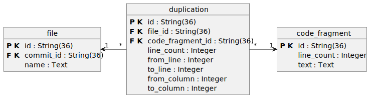
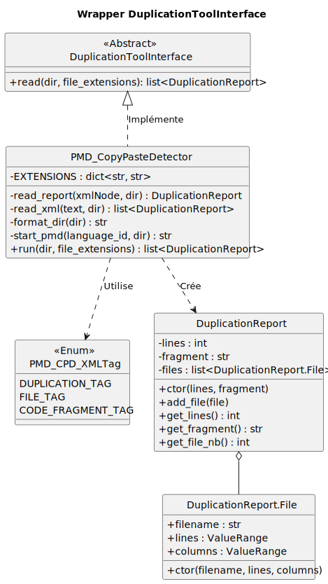
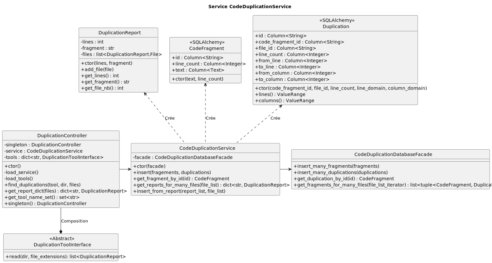
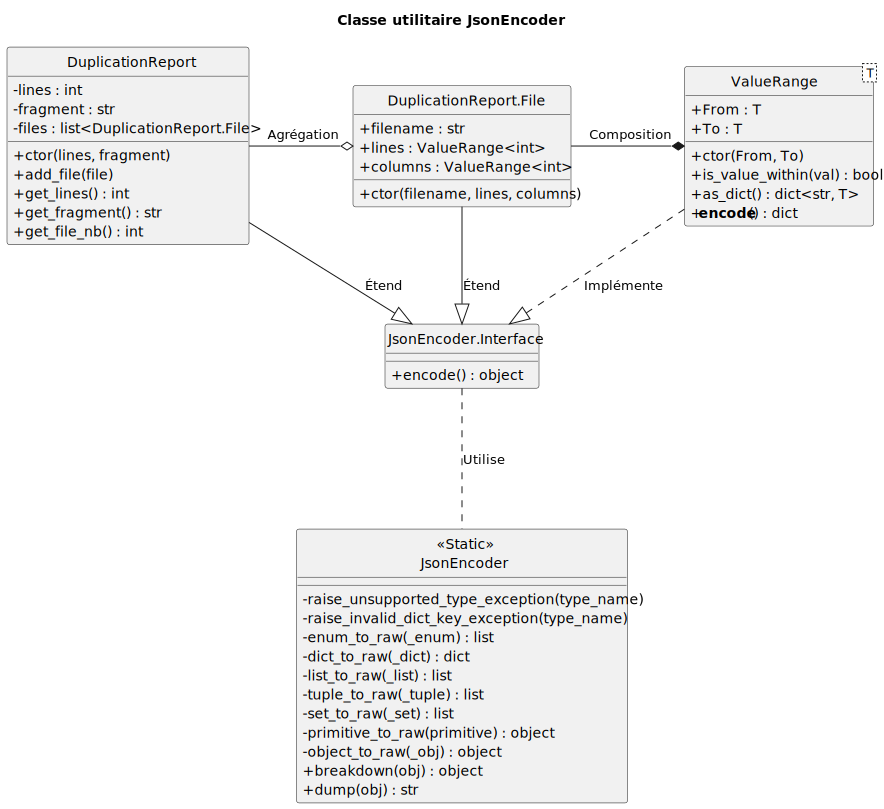

# Duplication de code

## Mise en contexte 

Dans le cadre du développement d'un outil pour analyser et suivre la dette technique, nous avions à détecter les duplications dans un ou plusieurs fichiers. Selon **Houssem Sebouai, de Axify**, la duplication de code est souvent indicateur de mauvaise pratiques (copiés-collés), d'une mauvaise architecture ou de déficiences en lisibilité. 

Ajoutons que la duplication de code peut aussi réduire la maintenabilité d'un logiciel lorsqu'un ou plusieurs  développeurs copie-collent une logique défaillante (bogues) à travers le code source : il faudra corriger la logique défaillante à chaque endroit où elle a été dupliquée, ce qui augmente considérablement le temps nécessaire pour corriger les bogues et, conséquemment, réduit le temps disponible pour le développement.  

## Objectif

L'objectif était d'ajouter une fonctionnalité qui répertoriait les duplications de code contenues dans les fichiers d'un commit Git, dans le but d'aider les mainteneurs ou développeurs à garder trace des duplications et suivre l'évolution de celle-ci à travers le temps. 

## Analyse

Dans un premier temps, il a fallu analyser les solutions envisageables pour ajouter la visualisation des duplications de code au projet. 

Étant donné la multitude de langages de programmation actuellement utilisés, la popularité des projets utilisant plusieurs langages de programmation et la complexité lié à l'implémentation d'une solution logicielle détectant la duplication de code, une solution fait maison n'a pas été retenue

Lors de la rédaction du plan de projet, nous avions identifié quelques outils logiciels open-source pouvant détecter la duplication de code : Lizard et PMD. 

### Lizard

Lizard est un analyseur de complexité cyclomatique supportant plusieurs langages de programmation populaires, tels que C++, Python, Java, etc. Sur la page de présentation de l'outil, il est inscrit qu'il est possible d'obtenir des métriques de duplication de code. Cet outil peut être utilisé comme librairie Python.

La principale lacune de cet outil est le manque de documentation sur l'utilisation du module détectant les duplications de code : la seule information fournie indique comment lancer l'analyse depuis un terminal, mais rien n'indique comment obtenir les métriques de duplications à partir de la librairie Python et le format du rapport n'est pas précisé. 

Lizard a été mis de côté en raison du manque de documentation et d'un format non-standard des rapport générés. Un outil étant mieux documenté semblait être un choix plus judicieux pour assurer un futur transfert de responsabilité vers une autre équipe de développement. 

### PMD (Copy-Paste-Detector)

PMD est un analyseur statique de code, multilangage et extensible, qui inclut un détecteur de duplications de code, nommé Copy-Paste-Detector (CPD). Selon la page de présentation, CPD supporte une grande variété de langages, tels que Python, C++, Typescript, etc. 

Contrairement à Lizard, la documentation de CPD est plus complète : on y retrouve les langages supportés, les formats de rapports, des exemples d'utilisation et de la documentation sur les arguments de ligne de commande. 

Les lacunes de CPD sont toutefois multiples : l'outil doit être lancé par ligne de commande, le runtime de Java est nécessaire pour utiliser CPD et il est nécessaire de télécharger PMD pour pouvoir utiliser CPD. 

Toutefois, par manque d'alternatives, CPD semblait être la solution répondant le mieux à nos besoins. 

## Intégration et configuration 

### Environnement 

Dans le projet, nous utilisions un Dockerfile pour automatiser et uniformiser l'environnement d'exécution. Initialement, notre Dockerfile se basait sur l'image de Python, mais PMD requiert Java pour s'exécuter et PMD ne peut être téléchargé avec le gestionnaire de paquet Python (Pip). Nous avons modifié le Dockerfile pour utiliser une image Ubuntu afin de pouvoir télécharger et configurer les dépendances nécessaires à l'exécution de PMD dans un environnement Docker. 

### Utilisation

CPD est utilisé dans le code pour obtenir un rapport de format XML contenant les bouts de codes dupliqués ainsi que les endroits et les fichiers où la duplication a été trouvée. Étant donné que CPD ne peut être utilisé comme librairie Python, un processus enfant est créé (avec `subprocess.run(...)`) pour exécuter l'outil. Le rapport XML est obtenu en capturant le texte contenu dans le descripteur de fichier `stdout` (si aucun nom de fichier n'est fourni à PMD, l'outil écrira le rapport dans `stdout`, soit l'affichage d'un terminal). 

Les paramètres utilisés pour exécuter CPD sont: 
- le chemin de l'exécutable: `/pmd/pmd-bin-7.18.0/bin/pmd cpd`
- le nombre minimal de jeton pour détecter une duplication: `--minimum-tokens <un nombre entier>` 
- le langage sélectionné : `--language <un langage>` (voir note 1 & 2)
- le format utilisé (XML): `--format XML`
- le dossier où se situant les fichiers à analyser: `--dir <un chemin>`

_Note 1: les identifiants de chaque langage supportés sont identifiés [_--ici--_](https://pmd.github.io/pmd/tag_CpdCapableLanguage.html)._
_Note 2: l'argument `--langage` est limité qu'à un seul langage de programmation. Pour chaque langage d'un projet, relancer PMD._

### Rapport

Bien que CPD peut générer un rapport dans d'autres formats, il est conseillé d'utiliser le format XML. Le format Texte est conçu pour la lecture humaine, alors que le format CSV contient moins d'informations pertinentes. 

La structure d'un rapport XML est la suivante: 
- `<pmd-cpd ...>` : C'est le noeud racine du document. Les paramètres de balises sont omis pour simplicité. 
    - `<file path="" totalNumberOfTokens="">` : Indique le chemin d'un fichier et son nombre de jetons. Le nombre de noeuds de ce type sera égal au nombre de fichiers trouvé par PMD dans le dossier sélectionné. 
    - `<duplication lines="" tokens="">`: Indique le nombre de lignes et le nombre de tokens pour un bout de code dupliqué. Le nombre de noeud de ce type sera égal au nombre de duplications distinctes que PMD détectera. 
        - `<file begintoken="" column="" endcolumn="" endline="" endtoken="" line="" path="">`: Indique l'emplacement d'une duplication. Le nombre de noeuds de ce type sera égal au nombre de fois qu'un même bout de code est dupliqué. Il peut y avoir plusieurs fois le même fichier si un fichier contient plusieurs fois le même bout de code. 
        - `<codefragment>`: Échantillon du bout de code dupliqué. 

Exemple de rapport: 
```
<?xml version="1.0" encoding="UTF-8"?>
<pmd-cpd ...>
    <file path="/.../file_a.py" totalNumberOfTokens="141"/>
    <file path="/.../file_b.py" totalNumberOfTokens="141"/>
    <duplication lines="8" tokens="27">
        <file begintoken="22" column="5" endcolumn="23" endline="19" endtoken="48" line="12" path="/.../file_a.py"/>
        <file begintoken="164" column="5" endcolumn="23" endline="19" endtoken="190" line="12" path="/.../file_b.py"/>
        <codefragment>
            <![CDATA[
    numbers = [1, 2, 3]
    total = 0
    for n in numbers:
        total += n
    return total

def duplicate_three():
]]>
        </codefragment>
    </duplication>
</pmd-cpd>
```

## Conception et Implémentation

### Base de données

Nous nous sommes inspirés du rapport XML généré par PMD pour organiser les métriques dans la base de donnée. Initialement, la base de données avait une table `file` contenant un identifiant unique, le nom du fichier et l'identifiant du commit Git associé. Les métriques de duplications sont conservées dans deux tables: `duplication` et `code_fragment`. La table `duplication` représente l'occurence et l'emplacement d'un fragment de code situé dans un fichier, alors que la table `code_fragment` représente le contenu d'un bout de code unique, repéré dans de multiples fichiers. Puisque la relation entre `file` et `code_fragment` est de type plusieurs-à-plusieurs, `duplication` agit en tant que table d'association. 

---


--- 

### Couche dorsale 

#### Classes enveloppantes (Wrapper classes)

Bien que peu d'alternatives à PMD existent pour détecter le code dupliqué, nous voulions éviter d'introduire un fort couplage avec PMD afin de permettre et faciliter l'intégration d'un ou plusieurs autres logiciels de détection de duplications. Pour assurer un faible couplage, nous avons créé l'interface `DuplicationToolInterface` avec la méthode abstraite `run(dir, file_extensions) : list<DuplicationReport>`  à implémenter. Cette structure permet d'aisément créer une nouvelle sous-classe pour l'ajout d'un outil : les modifications nécessaire à l'extérieur de l'enveloppe seront inexistantes, ou très mineures. 

Dans le diagramme de classe ci-dessous, la classe `PMD_CopyPasteDetector` implémente la méthode `run` de l'interface `DuplicationToolInterface`. Cette sous-classe est responsable d'obtenir le rapport généré par PMD, puis de le convertir en un objet Python `DuplicationReport`. La classe `DuplicationReport` contraint les sous-classes enveloppantes à respecter l'organisation attendue des données par le système : les sous-classes enveloppant les outils ne doivent pas insérer eux-mêmes les données afin de respecter la responsabilité des classes et assurer une haute cohérence. 

---


--- 

#### Façade, service & contrôlleur

La classe `CodeDuplicationService` est responsable de transformer des rapports `DuplicationReport` en objets SQL Alchemy (classes `CodeFragment` et `Duplication`), puis utiliser la facade `CodeDuplicationDatabaseFacade` pour sauvegarder les objets SQL Alchemy dans la base de données. Cette classe service est aussi responsable de l'opération inverse, soit d'obtenir les objets SQL Alchemy `CodeFragment` et `Duplication` associés à une liste d'objets SQL Alchemy `File` pour reconstruire une liste de rapports `DuplicationReport`. 

Nous avons utilisé une façade pour plusieurs raisons : 
- Assure une haute cohérence en séparant clairement les responsabilités
- Réduit la taille des classes et des méthodes
- Sépare les requêtes SQL Alchemy de la logique service
- Facilite l'écriture de tests unitaires
- L'instanciation externe de la façade permet de mieux contrôller le comportement du service lors des tests unitaires
- Les tests unitaires du service peuvent utiliser un mock de façade pour éviter de dépendre de la base de données
- La façade permet de convertir les objets non-mappés SQL Alchemy (`Row`) en objets natifs Python (`tuple`)

La classe `DuplicationController` est responsable du lancement de l'exécution de l'outil d'analyse, d'assurer la transmission les données provenant de l'outil vers le service de duplication et d'obtenir les rapports de duplications obtenus du service de duplication. Cette classe permet d'abstraire le service de duplication et l'exécution de l'outil dernière une interface simplifiée, afin de réduire le couplage entre les routes web, le service de duplication et les outils d'analyse (comme PMD). 

---


---

### Transmission des données

Étant donné l'approche client-serveur de la solution logicielle, nous devions transmettre au client les métriques, statistiques et données liées aux duplication de code, dans le but d'intégrer ces informations à une page web. L'objet retourné par la méthode `get_report_dict`, de la classe `DuplicationController`, est de type `dict[str, DuplicationReport]`, soit un dictionnaire liant un ID de fragment de code à une instance de classe `DuplicationReport`. 

Puisque l'interface utilisateur est une page web, les données de duplications doivent être envoyées au client en format JSON. Étant donné que seuls les types de base de Python sont supportés par la fonctionnalité `json.dumps`, nous avons créé une classe utilitaire `JsonEncoder` qui converti des instances de classes et des types plus complexes en objets Python sérialisables. Cette classe permet d'automatiser la sérialisation et éviter d'écrire manuellement un dictionnaire de clés-valeurs sérialisable. Par exemple, la classe `DuplicationReport` étend la classe `JsonEncoder.Interface`, ce qui permet aux instances de types `DuplicationReport` d'être convertis en dictionnaire sérialisable par `json.dumps`, puis d'être trasmis par le réseau au client.  

---


---

### Interfaces utilisateurs

Initialement, il était planifié d'afficher le nombre de duplication par fichier pour un commmit. Toutefois, avec les données que nous pouvions obtenir et les données que nous sauvgardions, nous avons décidé d'ajouter un composant de visualisation des duplications de code par fichiers à l'interface utilisateur. 

---
<u>Prototype d'interface - réalisé avec LibreOffice Draw</u>


--- 

- insérer image page web

## Limitations

- L'organisation des données dans la base de données est un facteur limitant. La normalisation prévient la duplication des informations, mais peut ralentir substentiellement les requêtes sur de larges plages de données.

- L'utilisation de PMD est limitant, puisque cet outil analyse un projet un langage à la fois, ce qui peut ralentir substentiellement l'analyse de plusieurs commits pour visualiser l'évolution de la duplication de code.

- L'utilisation de classes utilitaires "fait maison" peuvent devenir problématiques lors des transferts de responsabilités d'une équipe à la suivante, surtout si elles sont insuffisament documentées : il est généralement préférable d'utiliser des librairies ou cadriciels bien documentés, testés et surtout maintenus. 

---

##### Références

1. Houssem Sebouai. (2025, April 2). What Is Code Duplication and How to Fix It. Axify.io; Axify. 
https://axify.io/blog/code-duplication

2. Yin, T. (2022, September 3). Lizard. GitHub. 
https://github.com/terryyin/lizard

3. Documentation Index | PMD Source Code Analyzer. (n.d.). Pmd.github.io. 
https://pmd.github.io/pmd/index.html

4. Python Software Foundation. (2023). json — JSON encoder and decoder — Python 3.8.3rc1 documentation. Docs.python.org. 
https://docs.python.org/3/library/json.html

‌
‌