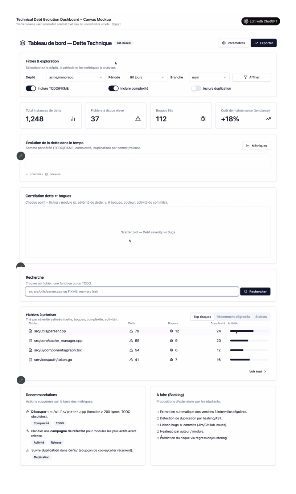

# Interface souhaité

## Mise en contexte 

Dans le cadre du développement d'un outil pour analyser et suivre la dette technique, nous avions à implémenter une interface web afin d'y présenter les résultats d'analyse et de suivi. Au début du projet, le superviseur du projet a fourni une maquette de l'interface souhaité, contenant des exemples de fonctionnalités souhaitées. 

---

--- 