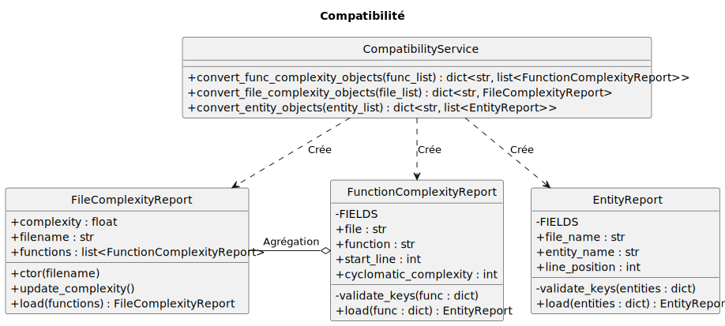
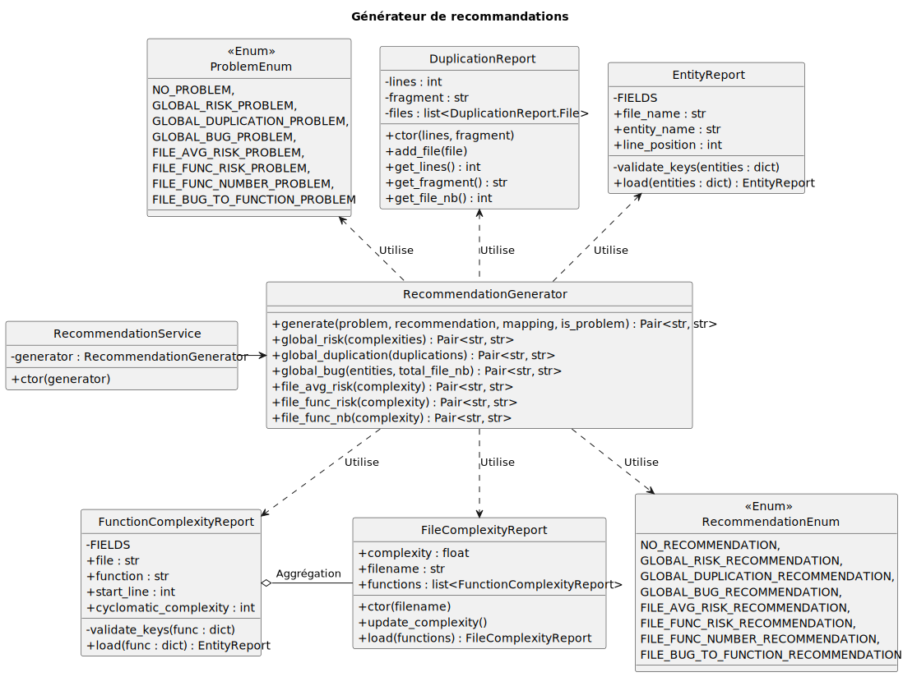
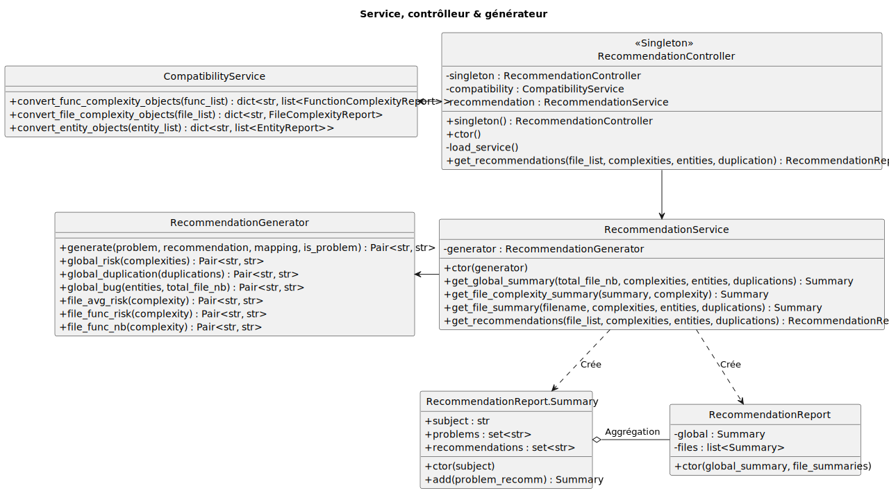
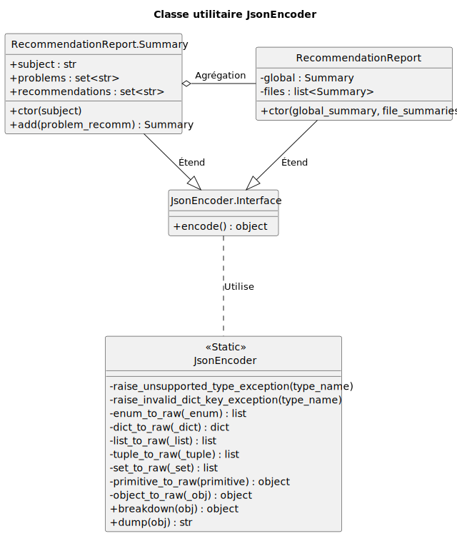
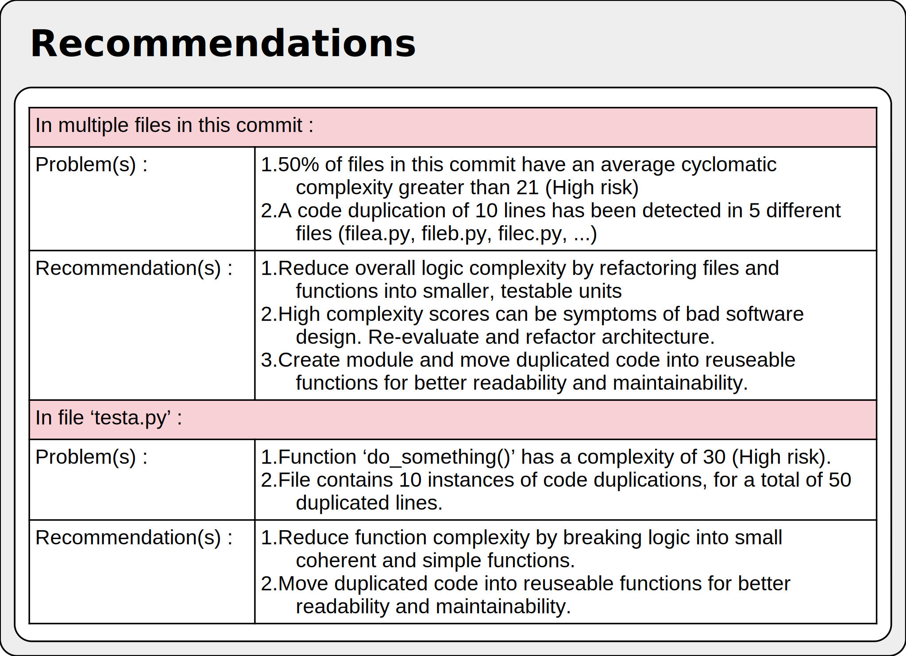
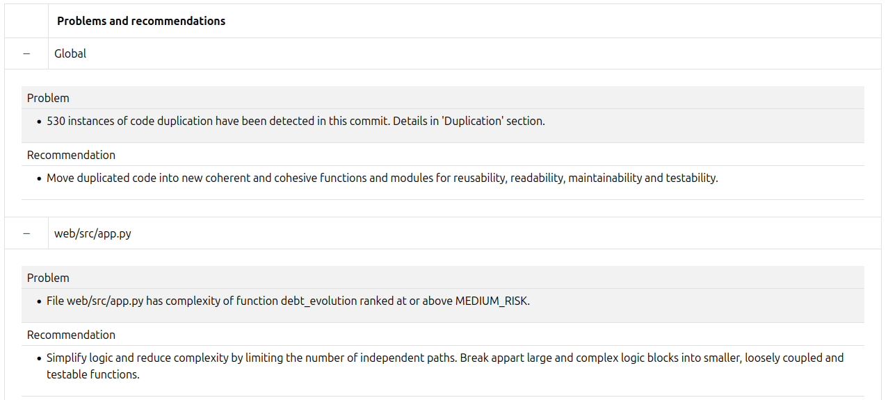

# Recommandations

## Mise en contexte

Dans le cadre du développement d'un outil pour analyser et suivre la dette technique, nous avions à implémenter une interface web afin d'y présenter les résultats d'analyse et de suivi. D'une maquette de l'interface web souhaitée, il était demandé d'implémenter une fonctionnalité de recommandations où s'afficheraient des actions suggérées dans le but d'aider à la gestion de la dette technique.

## Objectifs

L'objectif était d'afficher une liste d'actions recommandées, en lien avec la dette technique d'un projet.

## Analyse

Nous avons dirigé notre analyse selon les besoins exprimés dans une maquette, fournie au début du projet. L'image présentée ci-dessous est un extrait de la maquette fournie et présente les lignes directrices de la fonctionnalité de recommandations.

Comme indiqué dans cet extrait, les recommandations devaient être générées sur la base des métriques de dette technique : on y voit des étiquettes indiquant la ou les catégories problématiques, une suggestion d'action et une brève justification.

---

---

Afin de réaliser cette fonctionnalité, il a été décidé que les recommandations seraient générées, dans un premier temps, pour l'ensemble des fichiers d'un commit, puis dans un second temps, pour chaque fichier individuellement d'un commit. Les données de dette techniques détermineraient si une recommandation serait générée ou non en vérifiant si la donnée dépasse un seuil préétabli.

## Conception et implémentation

Cette fonctionnalité est supportée par une implémentation dans la couche dorsale (le serveur) ainsi qu'une implémentation dans la couche frontale (l'interface web).

### Couche dorsale

La fonctionnalité de recommandation s'intègre dans le processus d'analyse de dette technique pour un commis. Ce processus englobe l'analyse de dette technique et l'obtention des données pour chaque catégorie de métrique, soit la complexité, les bogues et la duplication de code. Étant donné que les recommandations font partie du processus d'analyse et que ce processus traite les données de dette techniques, la génération des recommandations est réalisée lorsque l'analyse du commit et l'obtention des données sont complétées : le processus de recommandation prendra ces données obtenues et les utilisera pour la génération des recommandations, évitant de devoir refaire le processus d'obtention.

#### Compatibilité

Une classe de compatibilité a été créée pour faciliter l'utilisation des données fournies par les processus d'obtention de la complexité et des bogues : les fonctions qui obtiennent les données de dette technique sauvegardées dans la base de données nous retournent ces données dans des listes de dictionnaires. La classe de compatibilité vient réorganiser les données dans des collections d'instances de classes pour permettre à l'outil de suggestion de code de détecter les attributs de l'instance; cela a aussi pour effet de réduire les chances d'entrer une clé invalide dans un dictionnaire.

---

---

Les classes `FunctionComplexityReport` et `EntityReport` contiennent une méthode `validate_keys` qui valide la présence de toutes les clés contenues dans l'attribut `FIELDS`. Une exception est soulevée lorsqu'une clé est introuvable.

#### Générateur

Les méthodes de la classe `RecommendationGenerator` sont responsables de générer une recommandation lorsqu'un problème de dette technique est détecté. Le système peut détecter 6 problèmes de dette technique : pour chaque problème, il y a un modèle de message avec un ou plusieurs jetons de remplacement (exemple: `@1`, `@2`, ...). Ces jetons de remplacement sont utilisés pour insérer des informations dans le modèle de message afin de préciser la nature, l'origine ou l'importance du problème. De plus, chaque problème doit être jumelé à un message de recommandation.

Les modèles sont contenus dans la classe d'énumération `ProblemEnum`. La liste suivante présente le contenu du modèle, son seuil de détection et la définition de ses jetons de remplacement.

- <b>NO_PROBLEM</b> = "No problems."

  - Condition : la métrique est sous le seuil de détection.

- <b>GLOBAL_RISK_PROBLEM</b> = "50% of files in this commit have an average complexity ranked at or above @1."

  - Condition : la médiane de la complexité de l'ensemble des fichiers d'un commit doit être supérieure à 10 (complexité modérée)

  - `@1`: le niveau de complexité (`MEDIUM_COMPLEXIY`, `HIGH_COMPLEXITY` ou `VERY_HIGH_COMPLEXITY`).

- <b>GLOBAL_DUPLICATION_PROBLEM</b> = "@1 instances of code duplication have been detected in this commit. Details in 'Duplication' section."

  - Condition : le nombre d'instances de duplication, pour l'ensemble du commit, doit être supérieur à 4.

  - `@1`: le nombre d'instances de duplication détecté.

- <b>GLOBAL_TODOFIXME_PROBLEM</b> = "For a total of @1 files, @2 files contained at least one 'todo' or 'fixme'."

  - Condition : il doit y avoir au moins 7% des fichiers du commit qui contiennent au moins commentaire "todo" ou "fixme".

  - `@1`: le nombre de fichiers total du commit.

  - `@2`: le nombre de fichiers dans le commit ayant au moins un commentaire "todo" ou "fixme".

- <b>FILE_AVG_RISK_PROBLEM</b> = "File @1 has an average complexity ranked at or above @2."

  - Condition : la complexité d'un fichier doit être supérieure à 10 (complexité modérée).

  - `@1`: nom du fichier.

  - `@2`: le niveau de complexité (`MEDIUM_COMPLEXIY`, `HIGH_COMPLEXITY` ou `VERY_HIGH_COMPLEXITY`).

- <b>FILE_FUNC_RISK_PROBLEM</b> = "File @1 has complexity of function @2 ranked at or above @3."

  - Condition : la complexité d'un fonction doit être supérieure à 10 (complexité modérée).

  - `@1`: nom du fichier

  - `@2`: signature de la fonction

  - `@3`: le niveau de complexité (`MEDIUM_COMPLEXIY`, `HIGH_COMPLEXITY` ou `VERY_HIGH_COMPLEXITY`).

- <b>FILE_FUNC_NUMBER_PROBLEM</b> = "File @1 has a total of @2 functions."

  - Condition : le nombre de fonctions contenues dans un fichier est supérieur à 29.

  - `@1`: nom du fichier.

  - `@2`: nombre de fonctions contenues.

Les messages de recommandation sont contenus dans la classe d'énumération `RecommendationEnum`. La liste suivante présente les messages de recommandation. À noter que ces messages sont dépourvus de jetons de remplacement étant donné les précisions contenues dans le message de problèmes généré.

- <b>NO_RECOMMENDATION</b>

  - Jumelé à <i>NO_PROBLEM</i>

  - ""

- <b>GLOBAL_RISK_RECOMMENDATION</b>

  - Jumelé à <i>GLOBAL_RISK_PROBLEM</i>

  - "Simplify logic and reduce complexity by limiting the number of independent paths in your functions. Break appart large complex functions into smaller, simpler and testable functions."

- <b>GLOBAL_DUPLICATION_RECOMMENDATION</b>

  - Jumelé à <i>GLOBAL_DUPLICATION_PROBLEM</i>

  - "Move duplicated code into new coherent and cohesive functions and modules for reusability, readability, maintainability and testability."

- <b>GLOBAL_TODOFIXME_RECOMMENDATION</b>

  - Jumelé à <i>GLOBAL_TODOFIXME_PROBLEM</i>

  - "Dedicate more ressources to fix bugs and implement missing features. Consider writing tests."

- <b>FILE_RISK_RECOMMENDATION</b>

  - Jumelé à <i>FILE_AVG_RISK_PROBLEM</i>

  - Jumelé à <i>FILE_FUNC_RISK_PROBLEM</i>

  - "Simplify logic and reduce complexity by limiting the number of independent paths. Break appart large and complex logic blocks into smaller, loosely coupled and testable functions."

- <b>FILE_FUNC_NUMBER_RECOMMENDATION</b>

  - Jumelé à <i>FILE_FUNC_NUMBER_PROBLEM</i>

  - "Decrease the number of functions either by redesigning your architecture or creating a new module. A large number of functions can be signs of high coupling and low cohesion, and usually decreases readability and maintainability."

Ces recommandations proviennent d'une analyse de la définition de chacune des métriques et de leur impact dans un projet.

Par exemple, dans une présentation de M. McCabe (voir dans la section _Références_), auteur de la complexité cyclomatique, on indique que plus une complexité est élevée, plus il y a un risque de bogue et une sécurité logicielle vulnérable. Rappelons que la complexité est le nombre de chemins indépendants pouvant être exécutés dans une fonction. Les fonctions qui contiennent des branches, des boucles et surtout un mélange de boucles et de branches imbriquées vont augmenter la valeur de complexité. Parallèlement, ces types de fonctions sont souvent intestables et considérées comme "code smell", ou simplement de la dette technique; pour y remédier, il faut refactoriser ces fonctions et repenser la logique de celles-ci.

Les objets retournés par les méthodes de la classe de génération sont de type `Pair[str, str]`. Le premier élément correspond au message de problème, le second à la recommandation. Le diagramme de classes ci-dessous illustre la relation entre le générateur et les objets de rapport qui contiennent les métriques de dette technique.

---

---

#### Service & contrôleur

La classe `RecommendationService` est responsable d'acheminer les données structurées de dette technique au générateur de recommandation (`RecommendationGenerator`), puis de construire un rapport de recommandations (`RecommendationReport`) contenant une collection de sommaires (`RecommendationReport.Summary`) pour chacun des fichiers fournis au service. Le contrôleur `RecommendationController` est responsable du déclenchement de la conversion des données (`CompatibilityService`) provenant des autres services en données structurées, puis de déclencher la génération d'un rapport de recommandation en fournissant les données structurées au service de recommandations.

Le contrôleur permet d'éviter du couplage entre le service de recommandation et les autres services du système, offre une interface simplifiée et abstraite les détails de l'implémentation de la fonctionnalité. Le générateur a été séparé du service pour limiter la complexité des méthodes, faciliter l'écriture de tests unitaires et assurer une bonne séparation des responsabilités.

---

---

#### Transmission des données

Étant donné l'approche client-serveur de la solution logicielle, nous devions transmettre au client un rapport contenant les problèmes et solutions recommandées pour chaque fichier dans le but d'intégrer ces informations à une page web. L'objet retourné par la méthode `get_recommendations()`, de la classe `RecommendationController`, est de type `RecommendationReport`, soit une instance de classe contenant une collection de sommaires (`RecommendationReport.Summary`) pour chacun des fichiers d'un commit.

Puisque l'interface utilisateur est une page web, les recommandations doivent être envoyées au client en format JSON. Étant donné que seuls les types de base de Python sont supportés par la fonctionnalité `json.dumps`, nous avons créé une classe utilitaire `JsonEncoder` qui convertit des instances de classes et des types plus complexes en objets Python sérialisables. Cette classe permet d'automatiser la sérialisation et éviter d'écrire manuellement un dictionnaire de clés-valeurs sérialisable. Par exemple, la classe `RecommendationReport` étend la classe ,`JsonEncoder.Interface` ce qui permet aux instances de types `RecommendationReport` d'être converties en dictionnaire sérialisable par `json.dumps`, puis d'être transmis par le réseau au client.

---

---

### Couche frontale

#### Interface souhaitée

Comme mentionné au début de ce document, l'interface souhaitée pour l'affichage des recommandations comprenait l'utilisation de verbes et d'un sujet, décrivant une action à entreprendre dans le but de contrôler la dette technique. Notons aussi la présence d'étiquettes, de précisions quant aux problèmes, et des icônes pour embellir et améliorer la présentation de l'interface.

---

---

#### Interface conçue

L'interface conçue reprend la vision illustrée dans l'interface souhaitée, mais apporte des détails supplémentaires quant aux problèmes trouvés, justifiant les recommandations émises. Bien qu'il puisse y avoir un volume important d'informations, le but de cet affichage est d'offrir une rétroaction, identifier et expliquer clairement les problèmes trouvés, et offrir des suggestions pour remédier à ces problèmes.

L'affichage reflète la façon dont le rapport de recommandations est obtenu du serveur : pour chaque fichier, le nom du fichier est affiché et les problèmes et recommandations contenus dans le sommaire du fichier sont insérés dans la case appropriée du tableau, sous forme de liste numérotée. Une section supplémentaire est affichée pour le sommaire de l'ensemble du commit.

---

---

#### Interface implémentée

L'interface implémentée diffère peu de l'interface conçue. La seule différence est l'ajout d'un bouton pour afficher ou cacher un sommaire, pour éviter de surcharger l'interface lorsqu'il y a plusieurs sommaires.

---

---

## Limitations

Le système de recommandation est conçu pour émettre des recommandations pour chaque fichier d'un commit ainsi que pour l'ensemble des fichiers d'un commit. L'implémentation pour les recommandations basées sur la variation des métriques dans le temps est manquante. Nous avons identifié 4 solutions réalisables :

- **Même contrôleur, même service, même générateur**

  - la fonctionnalité est implémentée en ajoutant les méthodes nécessaires aux classes existantes

  - aucune modification aux méthodes existantes

- **Même contrôleur, mais service et générateur différents**

  - utilisation du contrôleur `RecommendationController` pour l'accès à la fonctionnalité

  - aucune modification aux classes `RecommendationService` et `RecommendationGenerator`

  - création d'un nouveau service et d'un nouveau générateur pour les recommandations basées sur l'historique

- **Tout différent**

  - implémentation complètement séparée du système de recommandations actuel

- **Refactoriser et intégrer**

  - amélioration du système de recommandation existant pour le rendre plus extensible et réutilisable

  - implémentation plus cohésive de la fonctionnalité

---

#### Références

1. Murphy, James & Robinson III, John. (2007). Design of a Research Platform for En Route Conflict Detection and Resolution. 10.2514/6.2007-7803.

https://www.researchgate.net/figure/Cyclomatic-Complexity-Thresholds_tbl2_238659831

2. McCabe, T. (2008). Software Quality Metrics to Identify Risk (p. 22, p. 36) [Review of Software Quality Metrics to Identify Risk]. Department of Homeland Security Software Assurance Working Group.

https://web.archive.org/web/20220329072759/http://www.mccabe.com/ppt/SoftwareQualityMetricsToIdentifyRisk.ppt
