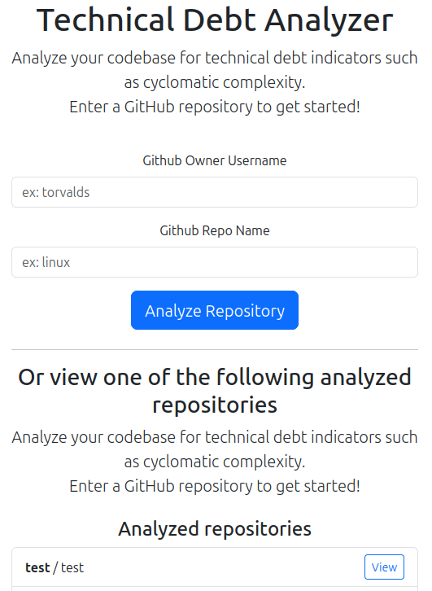
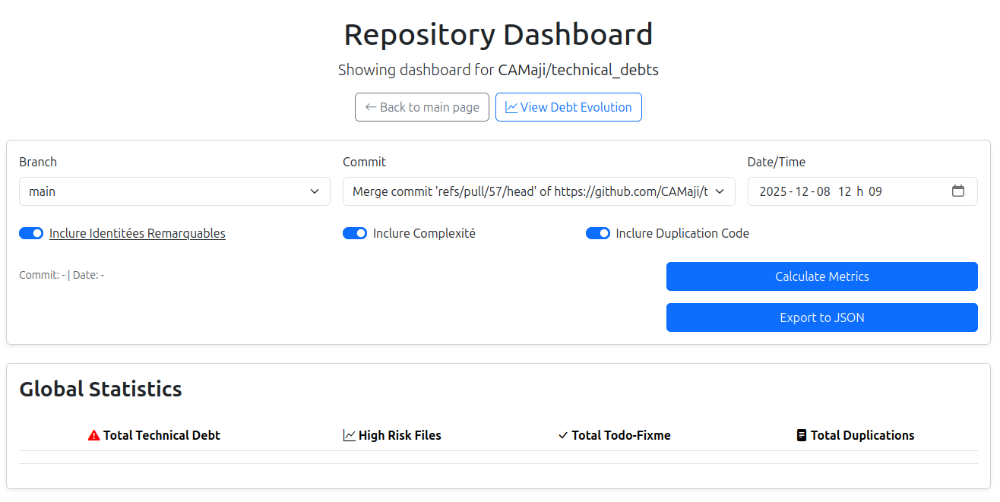
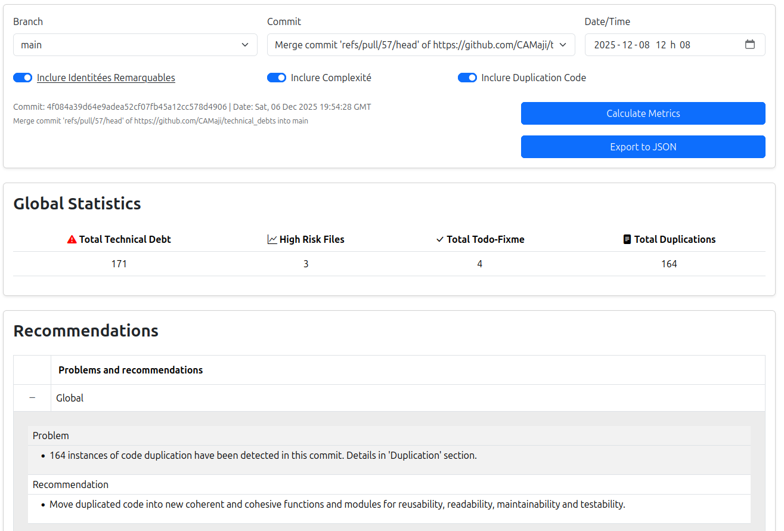
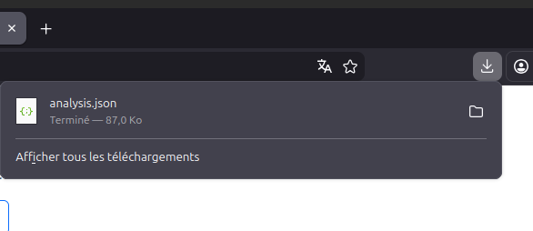

# Conception durable : Concevoir et développer un logiciel pour visualiser et maîtriser la dette technique dans les projets logiciels

## 0. Contenu

1. Introduction
2. Installation et configuration
3. Exécution
4. Structure du projet 
5. Fonctionnement global
6. Lectures supplémentaires

## 1. Introduction

Ce projet a pour but la conception et le développement d'une application web pour visualiser, suivre, et maîtriser la dette technique d'un projet logiciel versionné. Ce document vise à introduire le lecteur dans ce projet afin de faciliter son intégration et accélérer sa participation. 

## 2. Installation et configuration

**Répertoire Git**

Le projet est versionné sur Github. Le superviseur du projet sera en mesure de vous fournir le lien pour cloner le répertoire. Il est possible d'utiliser le logiciel de votre choix pour cloner le projet sur votre machine. 
- Git: https://git-scm.com/install/
- Git for windows : https://gitforwindows.org/
- Github desktop : https://desktop.github.com/download/

**Docker**

Le projet utilise Docker pour automatiser et uniformiser l'environnement d'exécution. Vous pouvez utiliser l'application Docker Desktop ou utiliser l'interface de commande. 

- Installation de Docker : https://docs.docker.com/get-started/get-docker/

**Éditeur de code**

PyCharm a de la difficulté à fonctionner avec la structure du projet, il est donc recommandé d'utiliser VSCode pour participer au développement du projet. 

- https://code.visualstudio.com/

Étant donné que le projet est développé en Python, il est recommandé d'installer les extensions VSCode suivantes: 

- https://marketplace.visualstudio.com/items?itemName=ms-python.vscode-pylance
- https://marketplace.visualstudio.com/items?itemName=ms-python.vscode-python-envs

**Documentation**

La documentation du projet est principalement écrite en Markdown et en PlantUML. Les installations suivantes sont optionnelles : vous pouvez écrire la documentation avec l'outil que vous préférez. 

Extensions VSCode: 
- https://marketplace.visualstudio.com/items?itemName=shd101wyy.markdown-preview-enhanced
- https://marketplace.visualstudio.com/items?itemName=jebbs.plantuml

Installation locale de Plant UML: 
- https://plantuml.com/fr/starting

## 3. Exécution

Pour cette section, assurez-vous que votre terminal se situe à la racine du projet. Lorsque vous êtes à la racine du projet, vous devriez voir les fichiers et dossiers suivants: 

```
doc
docker-compose.yml
nginx
plantuml
README.md
run-adminer.bat
run-adminer.sh
run-pytest.bat
run-pytest.sh
run-web.bat
run-web.sh
web
```

**Image docker**

Lancez la construction de l'image docker en faisant la commande `docker compose build .` 

À noter qu'il est normal que l'image prenne beaucoup de temps à construire : l'image est basé sur ubuntu et installe plusieurs dépendances tels que l'interpréteur Python, le gestionnaire de paquets Pip, tous les paquets Python, un outil nommé PMD et le JDK de Java pour exécuter l'outil PMD. 

**Lancement de l'application web**

Il y a deux façons de lancer l'application web : 
1. écrire la commande `docker compose up .` (monte tous les conteneurs)
2. exécuter le script `run-web.bat` (sur Windows) ou `run-web.sh` sur linux (monte seulement les conteneurs nécessaires)

La page web est accessible par votre navigateur à l'adresse http://localhost. 
Pour fermer l'application, vous pouvez soit fermer le terminal ou faire la combinaison Ctrl+C. 

**Lancement des tests unitaires**

Les tests unitaires sont lancés automatiquement si l'application est démarrée avec `docker compose up .` Il est possible d'exécuter seulement les tests en lançant le script `run-pytest.bat` (sur Window) ou `run-pytest.sh` (sur Linux). 

**Gestion de la DB** 

Bien que vous pouvez vous connecter à la DB postgres avec l'outil de votre choix, l'outil web Adminer est inclut dans le projet. Pour l'exécuter, vous pouvez lancer le script `run-adminer.bat` (sur Windows) ou `run-adminer.sh` (sur Linux). Pour le fermer, vous pouvez fermer le terminal avec lequel vous avez lancé le script, ou faire Ctrl+C. 

Adminer est accessible par votre navigateur web à l'adresse http://localhost:8080.
Voici les informations à entrer pour se connecter à la DB : 
- System: `PostgresSQL`
- Serveur : `postgres`
- User : `postgres`
- Password : `postgres`
- Database : `postgres`

Au besoin, voici le script SQL à exécuter dans Adminer pour supprimer toutes les tables : 
```
drop table duplication
drop table file_identifiable_entity
drop table complexity_count
drop table identifiable_entity_count
drop table identifiable_entity
drop table code_fragment
drop table complexity
drop table function
drop table file
drop table commit
drop table branch
drop table repository
```

## 4. Structure du projet

**À la racine :** 

- dossier `doc`: Contient la documentation du projet. 
- dossier `ngnix` : Contient les configurations nginx.
- dossier `web` : Contient le code source, les tests, le script Dockerfile, etc.

**Dans le dossier "/web" :**
- dossier `src` : Code source du serveur et de la page web.
- dossier `unit_tests` : Tests unitaires. Structure identique à celle du dossier `src`.

**Dans le dossier "/web/src" :**
- dossier `controllers` : Contient le code pour les controlleurs du serveur. 
- dossier `database` : Contient le code des classes façades qui séparent les appels à la DB et le code des services. 
- dossier `models` : Contient les objets mappés SQL Alchemy. 
- dossier `reports` : Contient les classes de données. Elles sont utilisées à plusieurs endroits, notemment pour la communication entre les classes. 
- dossier `services` : Contient le code des services du serveur. 
- dossier `static` : Code source des pages web
- dossier `templates` : Modèles de HTML pour afficher les pages web.
- dossier `tools` : Contient les classes "wrappers" des outils externes (tel que PMD, par exemple).
- dossier `utilities` : Contient des classes utilitaires, utilisées à plusieurs endroits.

## 5. Fonctionnement global

### Page d'acceuil

Lorsque l'utilisateur accède à l'application, le système affichera une page demandant d'entrer les informations d'un nouveau répertoire à analyser ou, si un répertoire a déjà été sauvegardé, choisir un répertoire dans la liste située sous le bouton "Analyse Repository". 

---



---

### Tableau de bord

Lorsque l'utilisateur a choisi le répertoire à analyser, le tableau de bord pour les résultats de l'analyse d'un commit sera affiché. À cet instant, l'utilisateur doit sélectionner une branche, un commit et les métriques, puis cliquer sur "Calculate Metrics" à afficher pour que l'interface soit populée d'informations. 

L'utilisateur peut aussi se diriger vers la page de l'évolution de la dette technique en cliquant sur le bouton "View Debt Evolution", situé sous le titre de la page. 

---


---

Une fois que l'utilisateur a lancé une analyse, le tableau de bord devrait contenir une multitude d'informations :

---


---

L'utilisateur peut aussi exporter les résultats de l'analyse en cliquant sur le bouton "Export to JSON". Un fichier JSON sera téléchargé sur l'appareil de l'utilisateur, contenant les données affichées dans le dashboard. 

---


---

### Évolution de la dette technique

Lorsque l'utilisateur aura cliqué sur le bouton menant à la page de l'évolution de la dette technique, il est normal que le chargement de la page soit long : le système doit analyser plusieurs commit. 

--- 
- à faire
--- 

## Lectures supplémentaires : 

[Wiki - Interface souhaitée par le superviseur](./interface-souhaite.md)
[Wiki - Base de donnée](./base-de-donnee.md)
[Wiki - Duplication de code](./duplication-de-code.md)
[Wiki - Recommandations](./recommandations.md)


